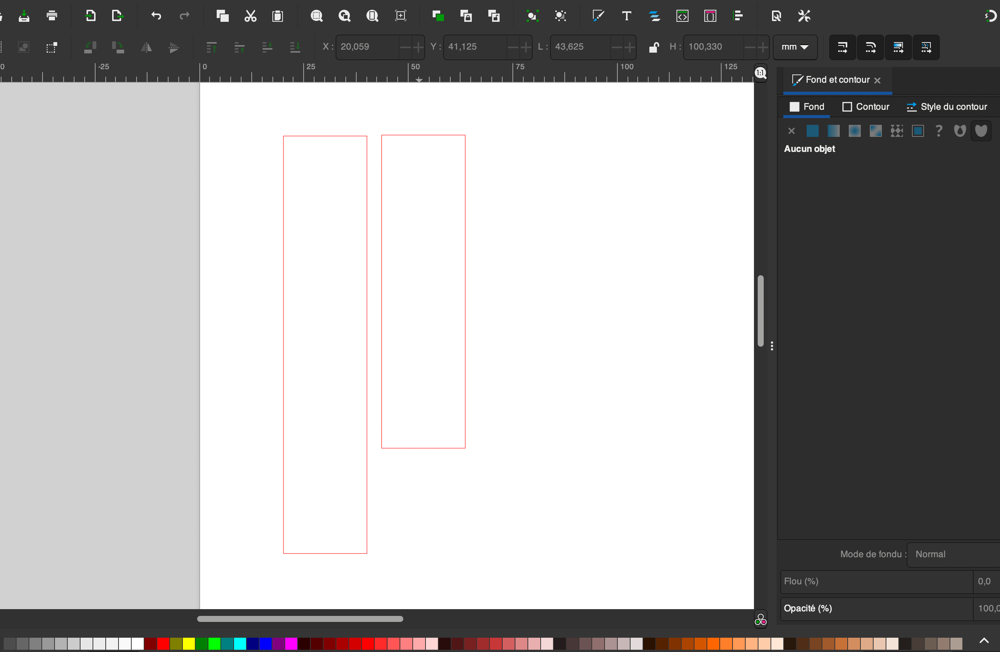

<h1>Séance 2 Charlotte FRÈRE</h1>

Cette séance, a pour moi, été la première car j'ai été malade lors de la séance 1. Evann m'a donc expliqué les quelques idées qu'il avait eu lors de la séance 1 comme par exemple :

<ul><li>le fait que nous allions réaliser un bras constitué de 3 servomoteurs permettant de faire bouger un stylo (situé au bout du troisième servomoteur) et permettant de dessiner sur notre feuille,</li> <li> ou encore, me donner les liens de quelques vidéos permettant de visualiser plus précisément le projet. </li></ul>

Pour cette séance, il est vrai que nous avons essayé de la commencer ensemble afin de nous faire une idée assez claire de ce que nous devions faire et allions avoir besoin afin de mener à bien notre projet.

Nous avons donc cherché sur internet, des projets similaires au nôtre afin de trouver le matériau idéal permettant de relier nos 3 servomoteurs qui dirigeront notre stylo. Et nous sommes arrivés à la conclusion que le matériau le plus efficace pour cette fonction était le bois.

Evann s'est alors occupé de la partie "code" du projet et quant à moi, j'ai découvert le logiciel Inkscape qui, après quelques tutos sur son utilisation basique, m'a permis de créer les formes nécessaires pour tenir nos servomoteurs :

<ul><li>un premier pavé de bois d'une épaisseur de 5mm et d'une longueur de 10cm qui reliera notre servomteur représentant "l'épaule" et le second représentant "le coude", </li> <li> un second pavé de bois toujours de 5mm d'épaisseur mais de 8cm de longueur permettant de relier le "coude" à "la main" (3ème servomoteur plus petit). </li></ul>

Pour terminer cette séance, je suis allée au FabLab afin d'effectuer la découpe laser des 2 pavés de bois que j'ai également dû, par la suite, poncer afin de rendre les côtés bien lisses et droits.

Le choix d'une épaisseur de 5mm pour ce bois, malgré sa difficulté lors de la découpe car le bois devient plus rapidement brûlé et plus compliqué à découper, est dû à la résistance importante et nécessaire permettant de tenir chaque servomoteur dont le poids n'est pas réellement négligeable. 

Enfin, nous nous sommes réunis en fin de séance afin de se montrer l'un à l'autre l'avancée de chacun au cours de cette séance. Nous avons également réfléchi ensemble à ce que nous pourrions utiliser pour tenir notre stylo et en sommes arrivés à la conclusion d'un support de compas posé sur un carré de bois qui serait lui-même fixé sur le petit servomoteur.

Lors de la prochaine séance, nous nous concentrerons sur la construction de notre bras.

