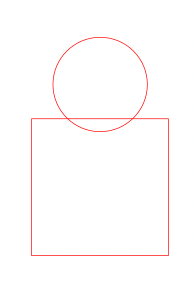
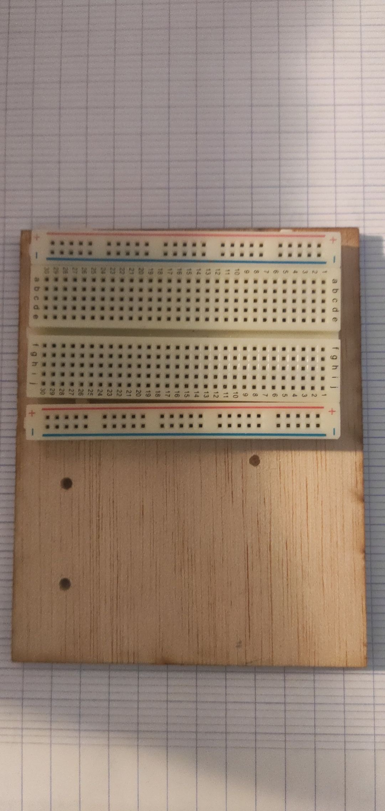

<h1>Séance 3 Charlotte FRÈRE</h1>

Lors de cette séance, nous avons donc décidé de changer, dans un premier temps, légèrement la façon de relier les servomoteurs.

Nous avons donc à partir de cette vidéo :
<a href="vidéo montage">https://youtu.be/Ss2v-dr_yWU</a> décidé de relier "l'épaule" au "coude" avec 2 planches de bois sur les côtés de nos servomoteurs ce qui allait faire bouger l'intégralité du servomoteur.
  

Or, en allant au FabLab pour découper de nouvelles planches de bois, j'ai pu faire part au professeur de notre idée, et en discutant nous avons trouvé plusieurs problèmes à notre idée suivant la vidéo, au niveau du fait que ce soit l'intégralité de notre servomoteur qui soit en mouvement et non simplement la planche de bois. En effet :

<ul><li>l'inertie très importante donc aurait eu besoin le servomoteur pour se déplacer nous aurait demandé de fournir trop d'énergie à ce dernier,</li> <li> c'est, effectivement, le poids non négligeable de ce servomoteur qui allait nous poser problème si nous décidions de le faire bouger dans son intégralité.</li></ul>

Nous avons donc décidé de fixer le servomoteur et de ne faire, uniquement bouger, que la planche de bois placée sur le dessus du servomoteur.

La majorité de la séance s'est donc, pour ma part, effectuée au FabLab où j'ai réalisé les tâches suivantes :

<ul><li>La réalisation de l'encoche permettant de fixer le servomoteur (en photo) : 1. prendre les mesures exactes afin que la planche de bois rentre parfaitement sur le servomoteur et son encoche, 2. sur Inkscape réaliser la forme un peu spéciale représentant l'encoche, 3. effectuer la découpe laser sur bois puis le ponçage. </li> 
<li> J'ai collé l'encoche sur la première planche de bois grâce à de la colle à bois.</li>
<li>J'ai fixé la totalité sur le servomoteur tout d'abord en les perçant, puis grâce à des vis et des écrous.</li></ul>

<ul><li>La réalisation de la grande planche de bois représentant le support de la carte arduino ainsi que de la plaque. Nous trouvions la plaque trop grande donc nous en avons trouvé une autre, plus petite et plus dans les dimensions de l'intégralité de notre projet.</li>
<li>J'ai ensuite collé grâce à de la colle à bois ainsi qu'un pistolet à colle chaude, ma plaque sur la planche de bois et ai rencontré un léger problème car la plaque s'est décollée quelques fois et j'ai donc dû recommencé avec l'aide d'un serre-joint lui permettant d'adhérer complètement au bois.</li>
<li>J'ai également cherché des vis ainsi qu'autre chose me permettant de fixer et surélever la carte arduino (afin que les éléments situés sur le dessous de la carte ne soient pas implantés dans le bois lorsque je visserai la carte), mais le professeur m'a montré des boîtes réalisées par d'anciens étudiants à Polytech permettant de "cacher" nos cartes arduino et pouvant être, elles, collées sur la planche de bois (ce qui est infaisable pour les cartes arduino). Je vais donc réfléchir quant au fait d'utiliser cette petite boîte ou bien réaliser tout simplement une box dans laquelle serait contenue la carte arduino ainsi que la plaque et les fils pour une raison d'esthétique (afin que les fils ne soient pas visibles).</li></ul> 

