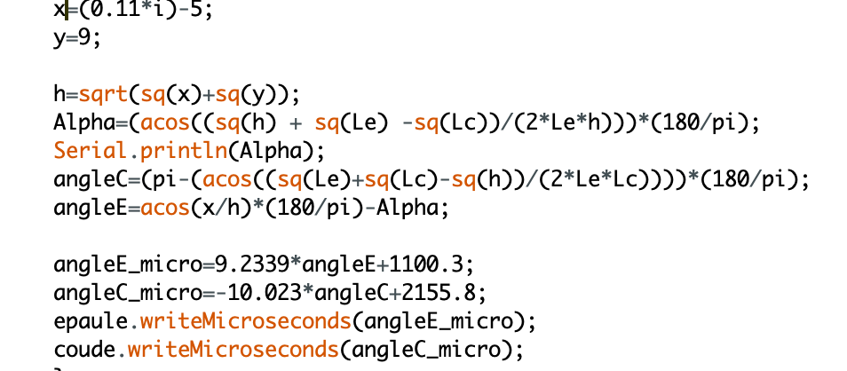

<h1>Séance 6 Charlotte FRÈRE</h1>

Lors de cette séance, j'ai tout d'abord presque terminé définitivement de construire le bras dessinateur. En effet, j'ai tout d'abord vissé le servomoteur représentant l'épaule avec un support moteur sur une planche de bois beaucoup plus épaisse que les autres (10mm d'épaisseur), ce qui permet au bras d'être surélevé et donc de tenir mieux et de dessiner plus précisément.

Ensuite, j'ai voulu collé cette petite planche de bois a celle où reposait la carte arduino ainsi que la plaque. Cependant je me suis rendue compte que tenter de mettre de la colle à bois sur une si petite surface n'allait jamais permettre de faire tenir mes 2 planches de bois ensembles. Avec les conseils de Mr.Masson, j'ai donc décidé de prendre une nouvelle planche de bois d'une épaisseur de 5mm mais beaucoup plus longue et large afin de pouvoir y coller : la première planche de bois contenant la plaque et la carte arduino, la seconde planche de bois tenant le gros servomoteur (et donc tout le bras) et enfin là où l'on mettra la feuille sur laquelle le stylo dessinera.

Je n'ai pas encore tout collé à cette grande planche car nous n'avons pas encore dessiné à quel endroit sur celle-ci nous devrions placer notre bras afin qu'il puisse dessiner librement et avec le plus grand rayon d'action possible.

La suite de la séance a été la plus compliquée et rude pour Evann comme pour moi. Nous nous sommes mis à deux afin d'enfin tenter de faire dessiner PROPREMENT notre stylo. Ce qui, pour le moment, est encore un échec. En effet, nous avons repris le programme des anciens PEIP2 ayant déjà réalisé un projet similaire au nôtre que nous avons réécrit à notre manière. La seule fonction que nous n'avons pas changé est "goTo", celle permettant de faire aller le stylo à des certaines coordonnées.

C'est à ce moment-là que les problèmes sont apparus. En effet, nous avons d'abord essayé de faire bouger chaque servomoteur afin de voir si chacun fonctionnait bien indépendamment des autres, puis nous les avons fait bouger ensemble. Tout marchait. Puis lorsque nous avons essayé la fonction goTo (de faire aller le stylo par exemple : de la position (4,0) à (6,0) donc une ligne droite horizontale), cela ne marchait pas et ne nous traçait absolument pas la ligne droite horizontale voulue. Parfois même, rien ne se déclenchait.

Nous avons donc décidé (sous les conseils de Mr.Masson) d'imprimer dans le moniteur série chaque ligne du goTo unes par unes afin de voir laquelle ne marchait pas.

La ligne "d=sqrt......" qui nous donne la distance de notre trait marchait. Puis lorsque nous faisions "Serial.println(Angle)", le moniteur série nous retournait "nan" en boucle. Nous ne connaissions pas cette erreur et Mr.Masson non plus. C'est sur cette partie que nous avons donc énormément bloqué. J'ai donc décidé de tester la fonction goTo issue d'une partie de programme des anciennes PEIP2 afin de voir si cette formule d'angle marchait dans le cas. Voici donc leur fonction goTo :

Ici, "Serial.println(Alpha)" marchait parfaitement et nous renvoyait bien un angle intermédiaire. Là est notre problème : la formule "Angle" de notre fonction est exactement la même que la formule "Alpha" de la leur. Nous ne comprenons donc pas pourquoi notre moniteur nous renvoie "nan" et non l'angle voulu.

Après le cours, nous avons recherché ce que voulait donc dire "nan", et nous avons trouvé "nan signifie que l'on essaye d'imprimer un float d'une valeur "Not a Number", qui n'est pas un nombre". Nous allons donc devoir comprendre pourquoi notre valeur "Angle" n'est pas un nombre.

Nous allons donc revenir plusieurs fois dans la semaine afin de résoudre ce problème et d'enfin pouvoir faire fonctionner notre fonction goTo et donc notre programme en général.

