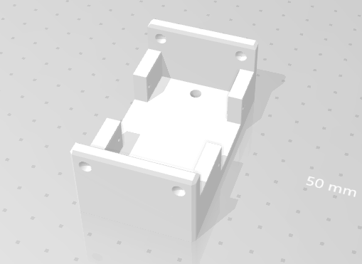

<h1>4éme séance Evann Corvaisier</h1>

Au début de notre séance nous avons presenté notre projet a 3 intervenants.

Ensuite j ai pu récuperer le système pour monter et descendre le stilo.

Celui ci fonctionne a partir d'un servomoteur S90 permettant de faire monter et descendre le support tenant le feutre.Comme le montre la vidéo ci dessous: 

<a href="vidéo pen lift">https://youtu.be/Ss2v-dr_yWU](https://youtu.be/tF2mantrnuI</a> 
  

Ainsi j ai pu monter notre systeme contenant 2 pièces avec 2 boulons et 2 visses sans tête.

J ai réalisé un programme permettant de faire fonctionner notre système en donnant des positions pour le servomoteur:

En effet nous voulions que la rotation créée par le servomoteur se transforme en tranlation sur l axe z (la hauteur pour baisser le stilo et le monter).

Ainsi j'ai trouvé des plans 3D pour l'impression du système.L'impression est en cours.

