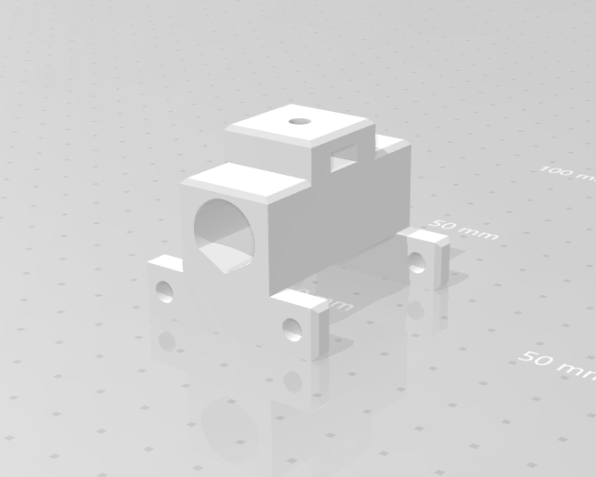

<h1>3éme séance Evann Corvaisier</h1>

Nous sommes arrivés avec l'envie d'avancer fortement sur la fabrication du bras

Au départ nous voulions créer un bras avec les 2 servomoteurs porté par le bois comme le montre la vidéo: 
<a href="vidéo montage">https://youtu.be/Ss2v-dr_yWU</a> 
  

Mais en réfléchissant avec notre professeur nous avons choisi d'avoir un servomoteur fixe permettant de bouger le reste pour avoir moins de soucis de poids.

Nous avons ainsi créé notre bras avec du bois découpé au laser et des vis et écrous pour le fixer au servomoteur.

J ai reflechi au problème qu'imposait le poignet du bras en regardant plusieurs vidéo sur youtube.

En effet nous voulions que la rotation créée par le servomoteur se transforme en tranlation sur l axe z (la hauteur pour baisser le stilo et le monter).

Ainsi j'ai trouvé des plans 3D pour l'impression du système.L'impression est en cours.

